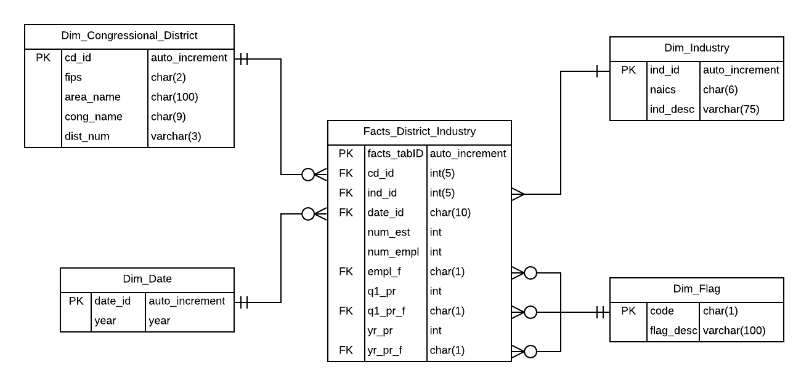

# Data-Science-Portfolio
Toyosi Bamidele's Data Science Portfolio

[SQL Project](https://github.com/toyobam92/Data-Science-Portfolio/tree/master/SQL%20Project)

Created an Entity relationship model and dimensional relationship model to populate census data in a database

Business Intelligence Project

[Key Considerations for Market Trends - COVID 19 as a case study](https://github.com/toyobam92/Data-Science-Portfolio/tree/master/Market%20Trend%20Analysis)

<noscript></noscript><object class='tableauViz'  style='display:none;'><param name='host_url' value='https%3A%2F%2Fpublic.tableau.com%2F' /> <param name='embed_code_version' value='3' /> <param name='path' value='views&#47;MarketTrendsduringaPandemic&#47;MarketTrrendsDashboard?:language=en&amp;:embed=y&amp;:display_count=y' /> <param name='toolbar' value='yes' /><param name='static_image' value='https:&#47;&#47;public.tableau.com&#47;static&#47;images&#47;Ma&#47;MarketTrendsduringaPandemic&#47;MarketTrrendsDashboard&#47;1.png' /> <param name='animate_transition' value='yes' /><param name='display_static_image' value='yes' /><param name='display_spinner' value='yes' /><param name='display_overlay' value='yes' /><param name='display_count' value='yes' /><param name='language' value='en' /></object>
               

[Multivariate Analyis on Heart Disease Data]
Cardiovascular disease is one of the leading causes of death globally according to the World Health Organization (WHO). Every year, more than 17 million die from cardiovascular diseases and most of them display heart failures. Heart failure could be defined as the inability of the heart to pump enough blood to meet the body’s needs for blood and oxygen. The purpose of this project is to analyse the survival rate of cardiovascular heart disease (CDH) patients who had undergone a heart failure. Using the region of Faisalabad (third most populous city of Pakistan) as case study, the dataset aims to investigate the major risk factors related to heart failure.

Data Visualization and Simple logisitic regression

[Project 1 Titanic Survival](https://github.com/toyosibamidele/Data-Science-Portfolio)

#The sinking of the RMS Titanic is one of the most infamous shipwrecks in history. 
#On April 15, 1912, during her maiden voyage, the Titanic sank after colliding with an iceberg,killing 1,502 out of 2,224 passengers and crew.

#This sensational tragedy shocked the international community and led to better safety regulations for ships. 
#One of the reasons that the shipwreck led to such loss of life was that there were not enough lifeboats for the passengers and crew. 

#Although there was some element of luck involved in surviving the sinking, some groups of people were more likely to survive than others, such as women, children, #and the upper-class conduct an analysis to learn the composition of the Titanic passengers and get a sense of what sorts of people were likely to survive.

#Using Titanic data, “Titanic.csv" describing the relevant information about the passengers, an analysis to learn the composition of the Titanic passengers and get a sense of what sorts of people were likely to survive is shown below

##[Project 2 Challenger Space Shuttle Oring - Failure Prediction](https://github.com/toyosibamidele/Data-Science-Portfolio)

#The Challenger's service to America's space program ended in tragedy on Jan. 28, 1986. Just 73 seconds into mission STS 51-L, a booster failure caused an explosion that resulted in the loss of seven astronauts, as well as the vehicle.The cause of the disaster was traced to an O-ring, a circular gasket that sealed the right rocket booster. 

#The available clean data(temperature vs. Oring damage) for the launches prior to the Challenger are 23 data points (Dalal et al, 1989) ranging from 53 degree F to 81 deg F from 1981 to 1986.

#A simple logistic regression model utilizing python, for binary classification data (no damage vs damaged orings )is used to determine the probability of O-ring #erosion given the temperature over time data from launches prior to challenger from 53-degree F to 81 degrees F.
#Given the available data, it can be inferred that lower temperatures at launch show some evidence of erosion damage

