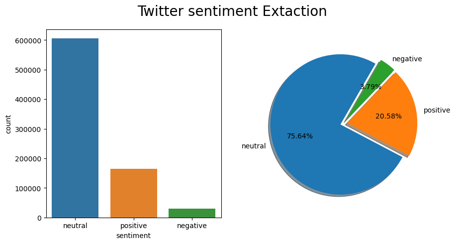
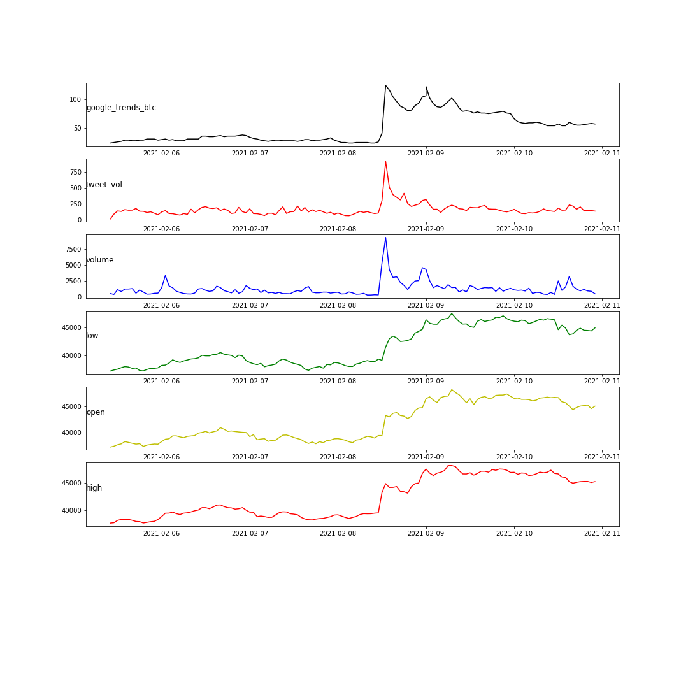
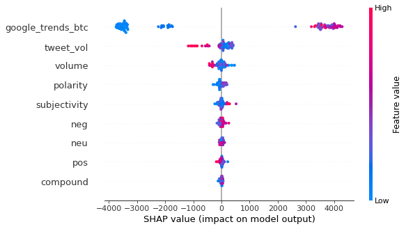

Data-Science-Portfolio
Toyosi Bamidele's Data Science Portfolio

[Sentiment Analysis](https://github.com/toyobam92/Data-Science-Portfolio/tree/master/Sentiment%20Analysis) - (Investigating the influence of Google trends data and Sentiment data for Price Prediction)
The rise of cryptocurrency, i.e., Bitcoin, as decentralized means of money transfer has given rise to the need for efficient methods for Bitcoin price forecasting. This analysis assesses the influence of Bitcoin-related Google web search volume and Tweet sentiment data in the prediction of Bitcoin prices during a short time window. As social media and web search usage increases, opinion mining and machine learning integration provide insights on periods whereby sentiment data and search volume relate to Bitcoin prices. An efficiently mapped data analysis system to ensure data quality and model efficiency is imperative. This analysis explores a machine learning framework from Data Sourcing, Data Preprocessing and Transformation, Exploratory Data Analysis, Correlation Analysis, Feature Selection, and Modeling. The system provided insights into areas for model improvement. Feature selection methods employed include Correlation Analysis, F-regression and Shapley values, and Long Short-Term Memory (LSTM) model for Bitcoin close price prediction. Overall, Google web search data proved to be a more robust feature vs. Tweet sentiment, as it improved model goodness of fit and reduced Root Mean Square Error (RMSE) alongside the historical close price. Furthermore, the results indicate that Google trends for the period examined influence Bitcoin's close prediction.

Tweet sentiment provides information on the subjectivity or polarity of tweets to examine attitudes and opinions towards Bitcoin. Public perception of Bitcoin provides information on investor's attitudes. Tweet polarity categorizes tweets as positive, negative, and neutral; positive and negative polarity shows attitudes ranges while neutral polarity shows the negligible impact on decision making regarding Bitcoin purchase or sale [7]. The Textblob library in Python possesses two functions, polarity and subjectivity; when applied to text data returns numerical values. Polarity is on a scale from [-1 to 1], indicating -1 as an opposing opinion and +1 indicates positive opinion [7]. Subjectivity is on a scale [0 to 1] which shows the closer to 1 indicates more subjective text related to less factual information [7]. Additionally, sentiment analysis utilizes Vader scoring, a rule-based tool that deals with words, slangs, and emojis commonly used by social media accounts, split into positive-negative, neutral, and compound polarities [2],[13]. Vader scoring adds an extra level of analysis by identifying emoticons and emojis and translating the attitudes to numerical data vs. plain text data [13].

The trend analysis reveals across google searches, tweet volume, and Bitcoin volume an upward spike on February 8th, 2021, as seen in Figure 2.1, which trends upwards with bitcoin prices as shown in Figure 1.5. With online news search, this spike reflects the news release of Telsa's purchase of $1.5 billion in bitcoin and its acceptance as a form of payment for its offerings[21].

Coupled with Random Forest, the output of the Shapley values algorithm reveals the top predictors as follows high, google trend, open, low.

[Spam Message Classification](https://github.com/toyobam92/Data-Science-Portfolio/tree/master/Spam%20Classification_NLP%20Project) 

Spam has become the bane of existence for many users and entities providing email services. Time is lost when sifting through unwanted messages and important emails may be lost through omission or accidental deletion.The upsurge in the volume of unwanted emails  and text messages called spam has created an intense need for the development of more dependable and robust antispam filters.The goal of this analysis is to classify the text data into spam and ham to determine legitimate message and spam messages The data will be used to create a model to predict the class of unseen records.

Techniques Explored: Cross Validation, Boosting, Stacking, OverSampling, UnderSampling, Synthetic Minority Over-sampling and Natural Language Processing methodologies

[Predicting Food Delivery Times](https://github.com/toyobam92/Data-Science-Portfolio/tree/master/Predicting%20Food%20Delivery%20times) 

This machine learning exercise aims to predict the estimated time taken for delivery(total_delivery_period). Understanding that extraordinarily early or too late orders has a much worse impact than slightly early/late, the prediction approach involves getting a clear understanding of each feature and its contribution to predicting the total delivery period. 

Features that contribute to the model's strong predictive power enable much more exact delivery times; resulting in improved customer and driver experience, customer retention, and increased driver referrals to join the dasher program, resulting in an overall revenue increase.

[SQL Project](https://github.com/toyobam92/Data-Science-Portfolio/tree/master/SQL%20Project) 
Created an Entity relationship model and dimensional relationship model to populate census data in a database

Business Intelligence Project - Python,Tableau

[Key Considerations for Market Trends - COVID 19 as a case study](https://github.com/toyobam92/Data-Science-Portfolio/tree/master/Market%20Trend%20Analysis)

This project focused on a market study for top 10 GDP countries pre and post COVID-19 pandemic. The objective of this study is to examine key considerations during market disruptions in these countries. For Market analysis datasets used are prices for Precious metals, Stock (One major Stock for each country) and Cryptocurrency. The aim is to gain insights on market and investment trends in the reign of a pandemic.

[Principal Component Analysis from scratch and a base model for classification](https://github.com/toyobam92/Data-Science-Portfolio/tree/master/Principle%20Component%20Analysis%20from%20Scratch)

Eigenfaces represents the set of eigenvectors of the covariance matrix of facial images, the essence of this approach is to capture the direction with the most variance and transform the original face images while preserving the most information.

PCA enables dimensionality reduction which is the first step in this process whereby eigenvectors are obtained to produce principal components that represent the original training images. The overall idea is to go from a d-dimensional dataset by projecting it onto a (k)-dimensional subspace (where k<d) in order to increase the computational efficiency while retaining most of the information.

The purpose of this project, is to classifiy a set of labelled faces using an euclidean distance model.

[Multivariate Analysis Project on Heart Disease Data](https://github.com/toyobam92/Data-Science-Portfolio/tree/master/Multivariate%20Analysis) R,Python

Cardiovascular disease is one of the leading causes of death globally according to the World Health Organization (WHO). Every year, more than 17 million die from cardiovascular diseases and most of them display heart failures. Heart failure could be defined as the inability of the heart to pump enough blood to meet the body’s needs for blood and oxygen. The purpose of this project is to analyse the survival rate of cardiovascular heart disease (CDH) patients who had undergone a heart failure. Using the region of Faisalabad (third most populous city of Pakistan) as case study, the dataset aims to investigate the major risk factors related to heart failure.

Data Visualization and Simple logisitic regression - Python

[Project 1 Titanic Survival](https://github.com/toyosibamidele/Data-Science-Portfolio)

The sinking of the RMS Titanic is one of the most infamous shipwrecks in history. 
On April 15, 1912, during her maiden voyage, the Titanic sank after colliding with an iceberg,killing 1,502 out of 2,224 passengers and crew.

This sensational tragedy shocked the international community and led to better safety regulations for ships. 
One of the reasons that the shipwreck led to such loss of life was that there were not enough lifeboats for the passengers and crew. 

Although there was some element of luck involved in surviving the sinking, some groups of people were more likely to survive than others, such as women, children, #and the upper-class conduct an analysis to learn the composition of the Titanic passengers and get a sense of what sorts of people were likely to survive.

Using Titanic data, “Titanic.csv" describing the relevant information about the passengers, an analysis to learn the composition of the Titanic passengers and get a sense of what sorts of people were likely to survive is shown below

[Project 2 Challenger Space Shuttle Oring - Failure Prediction](https://github.com/toyosibamidele/Data-Science-Portfolio) Python

The Challenger's service to America's space program ended in tragedy on Jan. 28, 1986. Just 73 seconds into mission STS 51-L, a booster failure caused an explosion that resulted in the loss of seven astronauts, as well as the vehicle.The cause of the disaster was traced to an O-ring, a circular gasket that sealed the right rocket booster. 

The available clean data(temperature vs. Oring damage) for the launches prior to the Challenger are 23 data points (Dalal et al, 1989) ranging from 53 degree F to 81 deg F from 1981 to 1986.

A simple logistic regression model utilizing python, for binary classification data (no damage vs damaged orings )is used to determine the probability of O-ring #erosion given the temperature over time data from launches prior to challenger from 53-degree F to 81 degrees F.Given the available data, it can be inferred that lower temperatures at launch show some evidence of erosion damage

